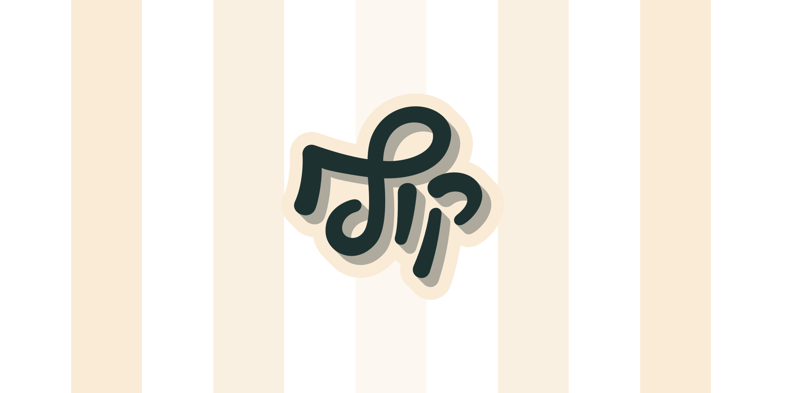

## Hello, Привет, ہیلو, שלום 👋🏻
<!-- ## Hello, नमस्ते, 你好, Hola, Bonjour, مرحبًا, হ্যালো, Привет, Olá, Halo, ہیلو, Hallo, こんにちは, Xin chào, Merhaba, 你好, שלום 👋🏻 -->
<!-- ## Hello, שלום, Привіт, مرحبًا, Hola, こんにちは, Hey, Bonjour, Salut, 你好, Привет 👋🏻 -->

<picture style="max-width: 640px; display: block;">
  <source srcset="kof-cover-dark.svg" media="(prefers-color-scheme: dark)">
  
</picture>

I’m _Yonatan Ben Knaan_, A full stack product designer and an alright dude form TLV

I build website for fun and my-go to is Vue, Nuxt, Netlify and dash of Notion API.

Currently a **product designer** at [Walnut](walnut.io)

### Links:

- [Art, articles, case studies and design 2026](https://wwape.com/)
- [Deprecated portfolio 2025](https://yonatanbk.netlify.app/)
- [Notion API](https://notion-api-vite-vue.netlify.app/) and its [how-to](https://yonatankof.notion.site/Working-w-Notion-API-Vite-Vue-df486e2d39394747842e10aa18e86569?pvs=4)
- [Portfolio 2024](https://yonatanbk.com/)
- [Portfolio 2020](https://yonatankof.com/)
- [Portfolio 2018](https://digital.yonatankof.com/)
- [Art & design 2010](https://design.yonatankof.com/)
